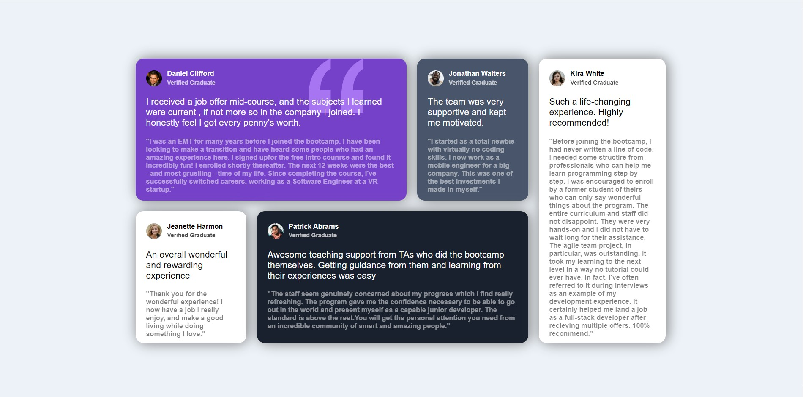

# Frontend Mentor - Testimonials grid section solution

This is a solution to the [Testimonials grid section challenge on Frontend Mentor](https://www.frontendmentor.io/challenges/testimonials-grid-section-Nnw6J7Un7). Frontend Mentor challenges help you improve your coding skills by building realistic projects. 

## Table of contents

- [The challenge](#the-challenge)
- [Screenshot](#screenshot)
- [Built with](#built-with)
- [What I learned](#what-i-learned)
- [Author](#author)

### Screenshot

### Links

- Solution URL: [Solution URL](https://github.com/CodingLife1024/testimonials-grid-section)
- Live Site URL: [Live Site URL](https://codinglife1024.github.io/testimonials-grid-section/)

### Built with

- Semantic HTML5 markup
- CSS custom properties
- Flexbox
- CSS Grid

### What I learned

Learned to use CSS grid framework for this Challenge.

## Author

- Frontend Mentor - [@CoderBoi1024](https://www.frontendmentor.io/profile/CoderBoi1024)
- GitHub - [@CoderBoi1024](https://github.com/CoderBoi1024)
